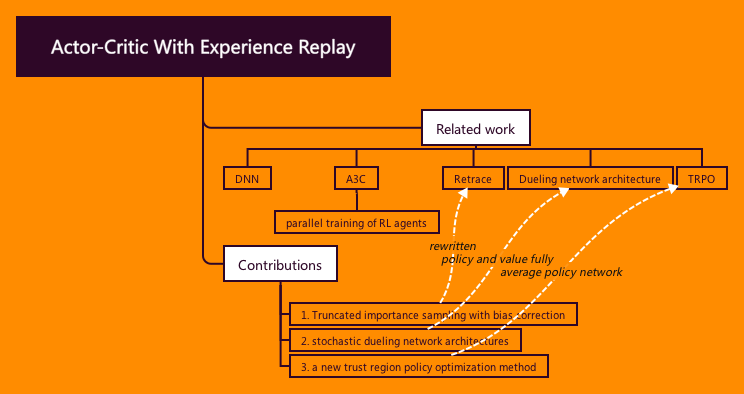

# Actor-Critic with Experience Replay
combining three breakthrough:
1. Truncated importance sampling with bias correction
2. stochastic dueling network architectures
3. a new trust region policy optimization method

Utilize recent developments in 
* deep neural networks, 
* variance reduction techniques, 
* the off-policy Retrace algorithm (Munos et al., 2016) Retrace
* parallel training of RL agents (Mnih et al., 2016) A3C

**Theoretical result:**
Retrace operator can be rewritten from our proposed truncated importance sampling with bias correction technique.

