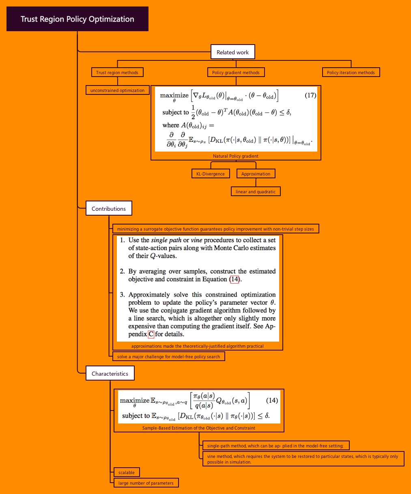

# Trust Region Policy Optimization
John Schulman, Sergey Levine, Philipp Moritz, Michael Jordan, Pieter Abbeel

> **Iterative procedure** for *optimizing policies*, with **guaranteed monotonic improvement**. 

## Big picture:

We have Theory for proving, but need approximations for real play.
Practical algorithm: Trust Region Policy Optimization (TRPO)

## Characteristics of TRPO:

1. natural policy gradient methods 
2. effective for optimizing large nonlinear policies such as neural networks. 

## Experiments:

performs robustly on a wide variety of tasks: 
1. learning simulated robotic swimming, hopping, and walking gaits
2. playing Atari games using images of the screen as input. 

## To remind:

1. approximations deviate from the theory
2. TRPO **tends** to give monotonic improvement, with little tuning of hyperparameters.

